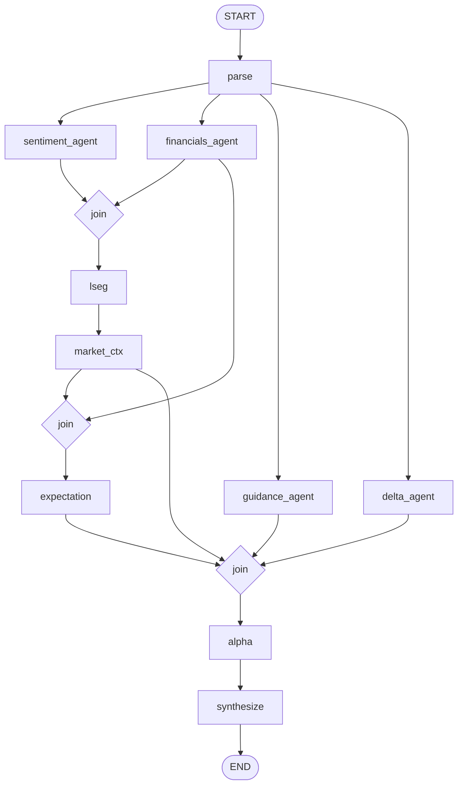

# MAECAS dashboard — end-to-end panel documentation

This document explains **how each part of the earnings dashboard is produced**: from uploaded transcript XML through the LangGraph pipeline, LLM prompts, schemas, and React UI. It follows the **same vertical order** as the live dashboard in `frontend/src/App.tsx`. Technical names (fields, files, graph nodes) are kept exact; explanations use plain English.

---

## 1. How a run works (short overview)

- The user uploads a **current** earnings call transcript as **`.xml`**. Optionally they attach **up to three prior** `.xml` files for quarter-over-quarter (QoQ) context (`POST /analysis/start` in [`backend/api/routes.py`](backend/api/routes.py)).
- The API creates a **job**, starts a **background task** that runs the compiled LangGraph (`graph.ainvoke`), and streams **SSE progress** (`GET /analysis/{job_id}/stream`).
- When the graph finishes, the final node writes an **`AnalysisReport`** object; it is **JSON-serialized** into the database (`job.result_json`).
- The frontend listens to SSE until `stage` is `complete` or `error`, then calls **`GET /analysis/{job_id}/result`** (`useAnalysis` in [`frontend/src/hooks/useAnalysis.ts`](frontend/src/hooks/useAnalysis.ts)) and renders the dashboard if the payload looks like a full report.

**LLM vs non-LLM steps**

- **No LLM:** `parse` (XML → structured transcript), `lseg` (HTTP/API market fetch), parts of **`delta_agent`** (word-rate and bigram math for language drift, fallbacks, sanitization), deterministic **citation index checks** and **warning classification** in the orchestrator ([`backend/agents/agent_08_orchestrator.py`](backend/agents/agent_08_orchestrator.py)).
- **LLM:** sentiment (multi-pass), financials, market context narrative, guidance, delta (pairwise + trend passes), expectation vs reality, alpha signals, orchestrator synthesis.

---

## 2. Pipeline flow (LangGraph)

The graph is built in [`backend/graph/pipeline.py`](backend/graph/pipeline.py). State fields are declared in [`backend/graph/state.py`](backend/graph/state.py).

**Edges (verbatim behavior)**

- `START → parse`
- `parse → sentiment_agent`, `parse → financials_agent`, `parse → guidance_agent`, `parse → delta_agent`
- `financials_agent` **and** `sentiment_agent` **both complete** → `lseg` → `market_ctx`
- `market_ctx` **and** `financials_agent` → `expectation`
- `market_ctx`, `guidance_agent`, `delta_agent`, `expectation` **all complete** → `alpha` → `synthesize` → `END`

The **`AnalysisReport`** is attached to graph output as `report` (see orchestrator return value).

---

## 3. Master panel mapping table

| Panel (UI order) | Primary `AnalysisReport` fields | Graph node(s) | Prompt YAML (when LLM) | Frontend |
|------------------|----------------------------------|---------------|-------------------------|----------|
| Sticky header pill | `metadata.company_name`, `metadata.company_ticker`, `metadata.event_date` | `parse` | — | [`frontend/src/App.tsx`](frontend/src/App.tsx) |
| Core Thesis | `signals.core_thesis`, `signals.bull_signals`, `signals.bear_signals` | `alpha` → `synthesize` (signals passed through) | [`backend/prompts/agent_07_alpha.yaml`](backend/prompts/agent_07_alpha.yaml) | [`frontend/src/components/CoreThesisHeader.tsx`](frontend/src/components/CoreThesisHeader.tsx) |
| Expectation vs Reality | `expectation_reality` | `expectation` | [`backend/prompts/agent_09_expectation.yaml`](backend/prompts/agent_09_expectation.yaml) | [`frontend/src/components/ExpectationRealityPanel.tsx`](frontend/src/components/ExpectationRealityPanel.tsx) |
| Transcript Scorecard | `sentiment`, `delta.language_drift`, `delta.guidance_specificity_delta`, `guidance.explicit_guidance`, `signals.bear_signals`, `risk_flags` | Mixed: sentiment + delta + guidance + alpha + synthesize | Sentiment: `agent_02_sentiment_presentation.yaml`, `agent_02_sentiment_qa_batch.yaml`, `agent_02_sentiment_synthesis.yaml` | [`frontend/src/components/RatingCard.tsx`](frontend/src/components/RatingCard.tsx) |
| Trading Signals | `signals` (full object) | `alpha` | `agent_07_alpha.yaml` | [`frontend/src/components/SignalFeed.tsx`](frontend/src/components/SignalFeed.tsx) |
| Key financial figures | `financials` | `financials_agent` | [`backend/prompts/agent_03_financials.yaml`](backend/prompts/agent_03_financials.yaml) | [`frontend/src/components/FinancialsChart.tsx`](frontend/src/components/FinancialsChart.tsx) |
| LSEG market data | `lseg_data`, `market`, `metadata` | `lseg` (fetch) + `market_ctx` | `agent_04_market.yaml` for `market_ctx` | [`frontend/src/components/LSEGInsightsPanel.tsx`](frontend/src/components/LSEGInsightsPanel.tsx) |
| Sentiment & analyst intelligence | `sentiment` | `sentiment_agent` | Presentation / QA batch / synthesis YAMLs above | [`frontend/src/components/SentimentPanel.tsx`](frontend/src/components/SentimentPanel.tsx) |
| Catalysts & guidance | `guidance` | `guidance_agent` | [`backend/prompts/agent_05_guidance.yaml`](backend/prompts/agent_05_guidance.yaml) | [`frontend/src/components/CatalystTimeline.tsx`](frontend/src/components/CatalystTimeline.tsx) |
| Quarter-over-quarter | `delta` | `delta_agent` | [`backend/prompts/agent_06_delta_pairwise.yaml`](backend/prompts/agent_06_delta_pairwise.yaml), [`backend/prompts/agent_06_delta_trend.yaml`](backend/prompts/agent_06_delta_trend.yaml) | [`frontend/src/components/DeltaView.tsx`](frontend/src/components/DeltaView.tsx) |
| Delta notes (what changed / downplayed / gems / warnings) | `narrative`, `hidden_gems`, `model_warnings`, `risk_flags` | `synthesize` | [`backend/prompts/agent_08_orchestrator.yaml`](backend/prompts/agent_08_orchestrator.yaml) | [`frontend/src/components/WhatChangedPanel.tsx`](frontend/src/components/WhatChangedPanel.tsx) |
| Transcript drawer | `transcript_utterances` | `parse` → copied into report in `synthesize` | — | [`frontend/src/context/TranscriptContext.tsx`](frontend/src/context/TranscriptContext.tsx), [`frontend/src/components/TranscriptDrawer.tsx`](frontend/src/components/TranscriptDrawer.tsx) |

**Stored but not shown on the current dashboard**

| Field | Produced by | Notes |
|-------|----------------|-------|
| `composite_scores` | Orchestrator LLM + `_composite_scores_with_prior` in code | Present in API JSON and TypeScript type; **no** React component reads it today. Useful for APIs or future UI. |
| `valuation_linkage` | Was designed for a valuation panel; orchestrator now sets **`None`** (see comment in `agent_08_orchestrator.py`: unit-scaling risk). Field kept for backward compatibility. |

---

## 4. Before the dashboard: upload and progress

**What you see**

- Upload form for current XML; optional prior quarter XMLs (up to three).
- Progress view lists SSE events until the pipeline completes or errors.

**Where the data lives**

- Job id returned from `POST /analysis/start`; events from `GET /analysis/{job_id}/stream`.

**How it is produced**

- [`frontend/src/components/Upload.tsx`](frontend/src/components/Upload.tsx) posts multipart form data.
- [`frontend/src/hooks/useSSE.ts`](frontend/src/hooks/useSSE.ts) consumes the event stream.
- [`frontend/src/components/Progress.tsx`](frontend/src/components/Progress.tsx) renders stages (`stage`, `agent`, `status`, `progress_pct`, `message`) from the backend callback in [`backend/api/sse.py`](backend/api/sse.py) (wired via `make_progress_callback` in routes).

**Frontend behavior**

- When SSE indicates completion, `App` keeps `view === 'progress'` until `useAnalysis` loads the report, then switches to `dashboard`.

---

## 5. Panel-by-panel detail (dashboard order)

### 5.1 Sticky header (company · ticker · date)

**What you see**

- Pill with company name, ticker, and call date.

**Where the data lives**

- `report.metadata` — type `TranscriptMetadata` ([`frontend/src/types/api.ts`](frontend/src/types/api.ts)).

**How it is produced**

- **`parse`** ([`backend/agents/agent_01_parser.py`](backend/agents/agent_01_parser.py)) calls `parse_transcript` in [`backend/services/xml_parser.py`](backend/services/xml_parser.py) (no LLM). Metadata is embedded in the parsed transcript model.

**Frontend behavior**

- [`App.tsx`](frontend/src/App.tsx) reads `currentReport.metadata.company_name`, `company_ticker`, `event_date` (date string truncated at `T` for display).

---

### 5.2 Core Thesis

**What you see**

- Eyebrow “Core Thesis”, one-line thesis, bull and bear paragraphs, “What would change this view” bullets, decision badge (**Buy / Monitor / Avoid**), conviction (**High / Medium / Low**), time horizon, and optional **key driver** / **key risk** lines resolved from signal ids.

**Where the data lives**

- `report.signals.core_thesis` (`CoreThesis`)
- Matching `Signal` rows in `signals.bull_signals` and `signals.bear_signals` via `key_driver_signal_id` and `key_risk_signal_id`.

**How it is produced**

- **`alpha`** ([`backend/agents/agent_07_alpha.py`](backend/agents/agent_07_alpha.py)) runs after `market_ctx`, `guidance_agent`, `delta_agent`, and `expectation` are available. It loads [`agent_07_alpha.yaml`](backend/prompts/agent_07_alpha.yaml), which instructs the model to: extract bull/bear signals with tiers, fill `so_what`, horizons, `pnl_linkage`, `priced_in_assessment`, then build `core_thesis` referencing **existing** `signal_id` values.
- **Code guardrails:** `_validate_core_thesis` checks driver/risk ids exist; `_enforce_tier_cap` demotes excess `primary` signals to `secondary`.

**Prompt / methodology (summary)**

- Alpha prompt stresses **priced-in judgment** using expectation-vs-reality, caps **at most three primary** signals, and requires **evidence citations** per signal.

**Frontend behavior**

- [`CoreThesisHeader.tsx`](frontend/src/components/CoreThesisHeader.tsx) maps `decision` and `conviction` to CSS classes; uses `ExplainableBadge` for short methodology tooltips.
- **Dedup:** On render it registers thesis text into [`DedupRegistryProvider`](frontend/src/lib/dedup.tsx) so later panels can avoid repeating the same facts.

---

### 5.3 Expectation vs Reality (“Market alignment”)

**What you see**

- Pre-call narrative, optional “grounded in” consensus numbers, **What changed** and **What market is missing** bullet lists (often with citation chips), and a **delta magnitude** badge (`minor` / `material` / `inflection`).

**Where the data lives**

- `report.expectation_reality` — type `ExpectationReality` (fields like `pre_call_market_narrative`, `pre_call_consensus_snapshot`, `what_changed_items`, `what_market_is_missing_items`, `delta_magnitude`, `citations`, `methodology`).

**How it is produced**

- **`expectation`** ([`backend/agents/agent_09_expectation.py`](backend/agents/agent_09_expectation.py)) runs after **`market_ctx`** and **`financials_agent`**. The model compares **stated transcript financials** and **LSEG-backed market context** to narrative expectations.

**Prompt / methodology (summary)**

- [`agent_09_expectation.yaml`](backend/prompts/agent_09_expectation.yaml) asks for structured bullets with citations and a qualitative `delta_magnitude`.

**Frontend behavior**

- [`ExpectationRealityPanel.tsx`](frontend/src/components/ExpectationRealityPanel.tsx) formats consensus numbers with `fmtConsensusNum`, maps `delta_magnitude` to styles and `ExplainableBadge` explanations, and renders `CitationButton` for each bullet when citations exist. `sourceLabel()` rewrites source strings for display (LSEG vs transcript).

---

### 5.4 Transcript Scorecard (“Text-derived”)

**What you see**

- Title **Transcript Scorecard**, subtitle about **ordinal labels only** (raw model scores not shown as numbers on the decision surface).
- Legend: **Tone**, **Hedging**, **Density metrics** (same copy as `LEGEND_ROWS` in code).
- Five rows: **Tone**, **Hedging**, **Evasion index**, **Guidance specificity**, **Risk density** — each with an ordinal badge and a short detail line.

**Where the data lives**

| Row | Main sources |
|-----|----------------|
| Tone | `sentiment.mgmt_confidence_presentation`, `mgmt_confidence_qa`, baselines on `SentimentProfile` |
| Hedging | `sentiment.hedging_frequency`, optional `delta.language_drift.hedging_drift` |
| Evasion index | `sentiment.evasion_scores` (count of scores ≥ 3, top topic) |
| Guidance specificity | `guidance.explicit_guidance` (count with both low and high), `delta.guidance_specificity_delta` |
| Risk density | `risk_flags.length` + count of **primary** bear signals in `signals.bear_signals` |

**How it is produced**

- **Tone / hedging / evasion / analyst metrics:** from **`sentiment_agent`** (multi-pass: presentation → QA batches → synthesis into `SentimentProfile`).
- **Guidance specificity delta:** from **`delta_agent`** (LLM `guidance_specificity_delta`, clamped in code).
- **Risk row:** **`risk_flags`** come from **`synthesize`** (orchestrator splits warnings); **primary bear** count from **`alpha`**.

**Prompt / methodology (summary)**

- Sentiment uses three YAML files: [`agent_02_sentiment_presentation.yaml`](backend/prompts/agent_02_sentiment_presentation.yaml), [`agent_02_sentiment_qa_batch.yaml`](backend/prompts/agent_02_sentiment_qa_batch.yaml), [`agent_02_sentiment_synthesis.yaml`](backend/prompts/agent_02_sentiment_synthesis.yaml). The synthesis pass merges passes into the final schema.

**Frontend behavior**

- [`RatingCard.tsx`](frontend/src/components/RatingCard.tsx) builds rows with `buildToneRow`, `buildHedgingRow`, `buildEvasionRow`, `buildGuidanceRow`, `buildRiskRow`.
- Ordinals come from [`frontend/src/lib/ordinal.tsx`](frontend/src/lib/ordinal.tsx): e.g. `toneToOrdinal` maps 1–10 scores to **Defensive / Mixed / Confident**; `densityToOrdinal` maps ratios to **Light / Notable / Heavy** (with `positiveIsGood` for guidance specificity).
- `ScoreShiftArrow` shows QoQ tone shift when prior-quarter baselines exist on the sentiment profile.

---

### 5.5 Trading Signals

**What you see**

- **Primary** and **secondary** bull/bear lists, signal metadata chips (**claim type**, **novelty**, **priced in**, **time horizon**, **P&L linkage**), **So what** text, evidence citations, optional **reasoning chain** and **balance** copy.

**Where the data lives**

- Entire object `report.signals` (`TradingSignals`: `bull_signals`, `bear_signals`, `direction`, `action`, `reasoning_chain`, `top_catalysts`, `balance_assessment`, `signal_methodology`, etc.).

**How it is produced**

- Produced only in **`alpha`**; orchestrator copies signals into the final report without re-ranking the list for display order (display logic is in the UI).

**Prompt / methodology (summary)**

- Same as Core Thesis: [`agent_07_alpha.yaml`](backend/prompts/agent_07_alpha.yaml) defines signal shape, `priority_tier`, and market-read fields.

**Frontend behavior**

- [`SignalFeed.tsx`](frontend/src/components/SignalFeed.tsx) groups by `priority_tier`, uses `useDedup` to skip repeating content already claimed by Core Thesis, maps enums to human labels (`PRICED_IN_STYLES`, `PNL_LINKAGE_LABELS`, etc.) and attaches long explanations via `ExplainableBadge`.

---

### 5.6 Key financial figures

**What you see**

- Stated numbers extracted from the call (labels, values, units, YoY where present). The card title is **Key Financial Figures**; it shows a compact list (first eight `figures` entries), not a time-series chart.

**Where the data lives**

- `report.financials` — `StatedFinancials` (`figures`, `qa_only_figures`, `declined_to_quantify`, `guidance_ranges`, confidence flags).

**How it is produced**

- **`financials_agent`** ([`backend/agents/agent_03_financials.py`](backend/agents/agent_03_financials.py)) with [`agent_03_financials.yaml`](backend/prompts/agent_03_financials.yaml).

**Frontend behavior**

- [`FinancialsChart.tsx`](frontend/src/components/FinancialsChart.tsx) maps `financials.figures.slice(0, 8)` into label/value rows and appends YoY % styling when `yoy_change` is present.

---

### 5.7 LSEG market data and context

**What you see**

- Instrument line (RIC, exchange), coverage flags, consensus block, estimate vs actual / surprise metrics, and transcript-vs-consensus comparison when the UI has both.

**Where the data lives**

- `report.lseg_data` (`LSEGMarketData`) — prices, consensus, fundamentals flags, FY0 surprise blocks, etc.
- `report.market` (`MarketContext`) — `beat_miss_flags`, `computed_metrics`, price windows, analyst summary, confidence, `methodology`.

**How it is produced**

- **`lseg`** node: `fetch_lseg` in [`backend/agents/agent_04_market.py`](backend/agents/agent_04_market.py) calls [`MarketDataService`](backend/services/lseg.py) (no LLM).
- **`market_ctx`** node: same module’s `run()` invokes the LLM with [`agent_04_market.yaml`](backend/prompts/agent_04_market.yaml) to reconcile **stated financials** with **fetched LSEG** data (beat/miss narrative, risks, confidence).
- Optional **deterministic** `computed_metrics` inside `agent_04_market.py` for specific figure patterns (e.g. revenue mix) when labels match.

**Frontend behavior**

- [`LSEGInsightsPanel.tsx`](frontend/src/components/LSEGInsightsPanel.tsx) combines `lseg_data`, `market`, and `metadata` for display and empty states when LSEG is unavailable.

---

### 5.8 Sentiment and analyst intelligence

**What you see**

- Presentation vs Q&A tone summaries, evasion / QA exchange cards, analyst topic coverage, speaker tone rows, stability or coverage notes when present.

**Where the data lives**

- `report.sentiment` — full `SentimentProfile` (scores, `evasion_scores`, `qa_exchanges`, `analyst_topic_map`, `speaker_tone`, `sentiment_stability`, `score_methodology`, etc.).

**How it is produced**

- **`sentiment_agent`** ([`backend/agents/agent_02_sentiment.py`](backend/agents/agent_02_sentiment.py)): deterministic **`_build_qa_exchanges`** from transcript structure, chunked QA LLM passes, then synthesis to `SentimentProfile`.

**Frontend behavior**

- [`SentimentPanel.tsx`](frontend/src/components/SentimentPanel.tsx) renders the profile; citation buttons open the transcript drawer when used.

---

### 5.9 Catalysts and guidance (“Forward view”)

**What you see**

- Explicit guidance ranges, implicit signals, catalyst cards (timeline, impact, probability, invalidation), surprise gap score label.

**Where the data lives**

- `report.guidance` — `GuidanceCatalysts` (`explicit_guidance`, `implicit_signals`, `catalysts`, `surprise_gap_score`, `surprise_gap_methodology`).

**How it is produced**

- **`guidance_agent`** ([`backend/agents/agent_05_guidance.py`](backend/agents/agent_05_guidance.py)) with [`agent_05_guidance.yaml`](backend/prompts/agent_05_guidance.yaml), using parsed transcript text.

**Frontend behavior**

- [`CatalystTimeline.tsx`](frontend/src/components/CatalystTimeline.tsx) lays out catalysts and related fields; may use `useDedup` for overlap with thesis/signals where applicable.

---

### 5.10 Quarter-over-quarter comparison

**What you see**

- Comparison window dates, topic buckets (new / both / dropped), language drift (hedging and certainty drift, started/stopped saying), trend deltas, trajectory chips, stability warnings.

**Where the data lives**

- `report.delta` — `QoQDelta` (`topic_deltas`, `language_drift`, `pairwise_comparisons`, `trend_deltas`, `topic_trajectory`, `stability_checks`, `comparison_window`, …). May be **`null`** if no prior XML was supplied.

**How it is produced**

- **`delta_agent`** ([`backend/agents/agent_06_delta.py`](backend/agents/agent_06_delta.py)):
  - **LLM:** `agent_06_delta_pairwise.yaml` per prior quarter, `agent_06_delta_trend.yaml` for multi-quarter trends when enough priors exist.
  - **Deterministic:** hedge/certainty rates per 1k words, bigram phrase diff, topic fallbacks, merging LLM drift with deterministic numeric drift, deduplication and clamps (see `_merge_language_drift`, `_deterministic_language_drift`, `_sanitize_pairwise`).

**Frontend behavior**

- [`DeltaView.tsx`](frontend/src/components/DeltaView.tsx) renders topic buckets, language drift, trend and trajectory blocks, and uses Recharts bar helpers where applicable; it imports `deltaToOrdinal` / `OrdinalChip` from [`frontend/src/lib/ordinal.tsx`](frontend/src/lib/ordinal.tsx) for direction-style chips on topic sentiment deltas.

---

### 5.11 Delta notes — what changed, downplayed, hidden gems, warnings

**What you see**

- Eyebrow **Delta Notes**; sections **What changed vs expectations** and **What management didn’t emphasize** (from `narrative`); **Under-discussed threads** (hidden gems); **Model warnings** and **Risk flags** (risk flags grouped by severity).

**Where the data lives**

- `report.narrative` — list of `NarrativeSection` (orchestrator keeps **`what_changed`** and **`management_downplayed`** for this panel).
- `report.hidden_gems` — `HiddenGem[]`.
- `report.model_warnings`, `report.risk_flags` — split from accumulated `pipeline_warnings` plus orchestrator LLM `warning_split`.

**How it is produced**

- **`synthesize`** = [`agent_08_orchestrator.py`](backend/agents/agent_08_orchestrator.py). It loads all upstream JSON into [`agent_08_orchestrator.yaml`](backend/prompts/agent_08_orchestrator.yaml), which instructs: composite scores, **non-redundant** narrative vs signals/thesis, hidden gems, and warning classification.
- **Code after the LLM:** `_audit_citations` checks utterance indexes for signals and narrative claims; `_composite_scores_with_prior` enriches scores with prior sentiment when available; `_classify_warnings` splits strings into model vs risk lists.

**Frontend behavior**

- [`WhatChangedPanel.tsx`](frontend/src/components/WhatChangedPanel.tsx) filters narrative to the two section keys, maps section keys to titles, renders `ClaimBlock` with `claim_type` and citations, renders gems with **Single-mention thread** when `mention_count <= 1`.
- **Risk severity:** [`frontend/src/lib/riskSeverity.ts`](frontend/src/lib/riskSeverity.ts) buckets `risk_flags` for display (keyword dictionary).

---

### 5.12 Transcript drawer (click-to-quote)

**What you see**

- Slide-out or drawer with full utterance list; clicking a **citation** in other panels jumps to the quoted utterance (`utterance_index`).

**Where the data lives**

- `report.transcript_utterances` — list of `Utterance` (`index`, `speaker_name`, `speaker_role`, `section`, `text`).

**How it is produced**

- Utterances originate in **`parse`**; orchestrator sets `transcript_utterances=list(transcript.utterances)` on `AnalysisReport` when building the report.

**Frontend behavior**

- [`TranscriptProvider`](frontend/src/context/TranscriptContext.tsx) receives `currentReport.transcript_utterances` from `App.tsx`. [`CitationButton`](frontend/src/components/CitationButton.tsx) opens the matching quote. A separate API `GET /analysis/{job_id}/transcript` exists for the same payload shape if needed.

---

## 6. Cross-cutting concepts

### 6.1 Evidence citations

- Schema: `EvidenceCitation` — `speaker`, `section`, `utterance_index`, `quote`.
- **Grounding:** Orchestrator walks bull/bear signals and narrative claims and flags bad indexes ([`_audit_citations`](backend/agents/agent_08_orchestrator.py)).
- **UI:** Citation chips resolve through transcript context for scroll/highlight behavior.

### 6.2 `composite_scores`

- **Produced:** Orchestrator LLM output, validated as `CompositeScore` objects; `prior_score` may be filled from prior-quarter sentiment in code.
- **Consumed:** Not bound to any dashboard component in the current repo; still part of the JSON contract for integrations.

### 6.3 `valuation_linkage`

- **Intended use:** Link guidance to consensus-implied upside scenarios.
- **Current behavior:** Explicitly set to **`None`** in orchestrator (comment: dashboard panel removed; scaling risk). Field remains in schema for old stored jobs.

### 6.4 Ordinal bucketing reference (scorecard)

| UI helper | Input | Buckets (labels) |
|-----------|--------|------------------|
| `toneToOrdinal` | 1–10 mgmt confidence avg | ≥7 Confident, ≥4 Mixed, else Defensive |
| `hedgingToOrdinal` | 1–10 hedging | ≤3 Direct, ≤6 Some hedging, else Heavy hedging |
| `densityToOrdinal` (evasion/risk) | 0–1 ratio | ≥0.5 Heavy, ≥0.2 Notable, else Light (higher = more concerning) |
| `densityToOrdinal` (guidance, `positiveIsGood: true`) | concrete/total | Same cutoffs; higher = better |

Raw numeric scores stay in the JSON for debugging but the scorecard **only shows ordinals** plus short explanations (see `ExplainableBadge` copy in `RatingCard.tsx`).

---

## 7. File index (quick reference)

| Area | Path |
|------|------|
| Dashboard layout | `frontend/src/App.tsx` |
| Graph definition | `backend/graph/pipeline.py` |
| Graph state | `backend/graph/state.py` |
| Final report schema | `backend/schemas/report.py` |
| API + pipeline runner | `backend/api/routes.py` |
| Agents package | `backend/agents/agent_0*.py` |
| Prompts | `backend/prompts/*.yaml` |
| LSEG integration | `backend/services/lseg.py` |

---

*Document generated to match the MAECAS codebase layout and the dashboard flow described in the MAECAS implementation plan. For methodology at the product level, see also `MAECAS_Dashboard_Methodology_Report.md` and `Dashboard_Panel_Explanatory_Report.md` if present in the repo.*
