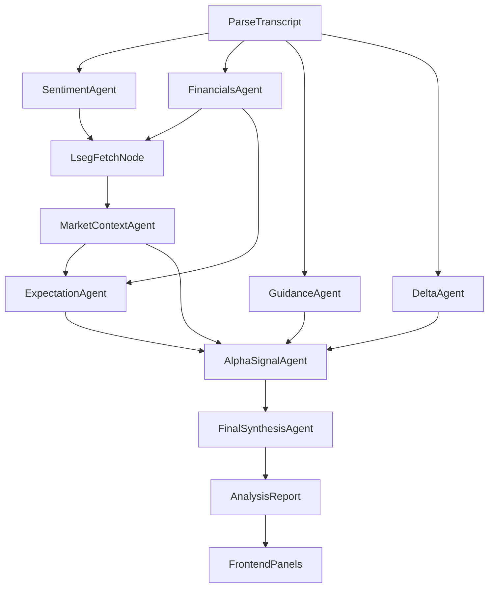

# MAECAS Earnings Dashboard: Panel-by-Panel Explanatory Report

## 1) End-to-End Pipeline: How the Dashboard Is Produced

The dashboard is a rendered view of one `AnalysisReport` object assembled by the backend graph and displayed by the frontend.

### 1.1 Agent Order and Dependencies
- Graph execution order is defined in `backend/graph/pipeline.py`.
- `ExpectationAgent` (`agent_09`) needs market context + financials.
- `AlphaSignalAgent` (`agent_07`) consumes sentiment, market context, guidance, delta, and expectation/reality.
- `Orchestrator` (`agent_08`) is final synthesis (composite scores, narrative sections, hidden gems, warning split).

### 1.2 Frontend Panel Consumption
- Dashboard panel order is in `frontend/src/App.tsx`.
- Each panel reads a subset of `AnalysisReport` from `frontend/src/types/api.ts`.

---

## 2) Core Thesis Panel

Panel: `frontend/src/components/CoreThesisHeader.tsx`  
Backend source: `signals.core_thesis` from `agent_07_alpha` and schema in `backend/schemas/signals.py`.

### 2.1 What It Shows
- Thesis one-liner.
- Decision badge (`Buy`, `Monitor`, `Avoid`).
- Conviction badge (`High`, `Medium`, `Low`).
- Horizon badge (`0-3m`, `3-6m`, `6-12m`, `12m+`).
- Bull case and bear case text.
- “What would change this view” falsifiers.

### 2.2 Your Question: What Does “HIGH CONVICTION” Mean?
- In this system, conviction is an **LLM bucket**, not a deterministic formula.
- UI explanation defines High as: primary driver is clear, evidence is well cited, and key risk is explicit.
- Other options are `Medium` and `Low` (schema-constrained enum).

### 2.3 How Bull/Bear/What-Would-Change Are Concluded
Step-by-step:
1. `agent_07_alpha` generates bull and bear signals from upstream payloads (sentiment, market, guidance, expectation, delta).
2. It assigns `priority_tier` and other metadata to each signal.
3. It then creates `core_thesis` after signals are “locked”.
4. `key_driver_signal_id` and `key_risk_signal_id` must match actual signal IDs; code validates this.
5. `what_would_change_this` is generated as 3-5 falsification triggers.

Interpretation: this is structured model synthesis constrained by schema and ID consistency checks, not raw numerical optimization.

---

## 3) Expectation vs Reality Panel

Panel: `frontend/src/components/ExpectationRealityPanel.tsx`  
Backend source: `expectation_reality` from `agent_09_expectation` and schema in `backend/schemas/expectation.py`.

### 3.1 What It Shows
- `Market expected`: pre-call narrative.
- “Grounded in” source chips.
- Optional FY1 consensus snapshot (EPS/Revenue/EBITDA).
- `What changed`: deltas from pre-call expectation to post-call call content.
- `What market is missing`: possible mispricing gaps.
- `delta_magnitude` badge: `minor`, `material`, `inflection`.

### 3.2 Your Question: What Does “MATERIAL” Mean? Other Options?
- `material` means meaningful narrative shift but not full thesis break.
- Other options:
  - `minor`: mostly confirms expectations.
  - `inflection`: thesis-altering change.
- These meanings are explicitly encoded in prompt and UI explanations.

### 3.3 Your Question: Why Is “MARKET EXPECTED” Grounded in Transcript-Like Sources?
Your concern is valid. Conceptually, expectation is pre-call and should be consensus/context driven. In this implementation:
- Prompt instructs pre-call narrative from consensus + stated financials + market context.
- However “stated financials” and “market beat/miss context” are downstream artifacts tied to the call payload and processing.
- So the field is not a pure external pre-call feed; it is a **model-reconstructed pre-call narrative** using available pipeline inputs.

Conclusion: your critique is correct; “Market expected” is not strictly isolated from post-call-derived structures in this version.

### 3.4 Your Question: What Does “WHAT CHANGED” Mean?
- It means explicit deltas between pre-call narrative and post-call facts/themes.
- It does **not** necessarily mean “only negative misalignments.”
- It can include both positive and negative shifts in narrative, guidance framing, or emphasis.

### 3.5 Your Question: What Is “WHAT MARKET IS MISSING”? How Is It Different?
- `What changed`: descriptive delta.
- `What market is missing`: pricing hypothesis (what may still be under-modeled/underpriced).
- In short: changed = diagnosis; missing = potential market implication.

---

## 4) Transcript Scorecard Panel

Panel: `frontend/src/components/RatingCard.tsx`  
Primary backend inputs: `sentiment`, `guidance`, `risk_flags`, and `signals`.

### 4.1 Why It Feels Black-Box
It mixes:
- LLM-derived subfields (e.g., evasion scores).
- Deterministic frontend bucketing logic (ratios and thresholds converted to ordinal labels).

So the display is simplified ordinal output over heterogeneous upstream judgments.

### 4.2 Full Dimensions and How They Are Computed

#### Tone
- Computed from average of `mgmt_confidence_presentation` and `mgmt_confidence_qa` (1-10 each).
- Bucket scale shown in legend:
  - 1-3 Defensive
  - 4-6 Mixed
  - 7-10 Confident

#### Hedging
- Uses `hedging_frequency` (1-10).
- Bucket scale shown in legend:
  - 1-3 Direct
  - 4-6 Some hedging
  - 7-10 Heavy hedging

#### Evasion Index
- Built from `sentiment.evasion_scores`.
- “Hot” evasion count = entries with score >= 3.
- Ratio = hot / total questions with evasion entries.
- Then mapped via density buckets:
  - <20% Light
  - 20-49% Notable
  - >=50% Heavy

So yes, “Heavy” has defined meaning in this UI. It is not the only level.

#### Guidance Specificity
- Ratio = count of explicit guidance ranges that have both low and high bounds / total guidance ranges.
- Density mapping is same ordinal rubric:
  - <20% Light
  - 20-49% Notable
  - >=50% Heavy
- But this metric is “positive is good” in mapping logic.

#### Risk Density
- Constructed as: number of `risk_flags` + number of `primary` bear signals.
- Ratio capped by `min(1, total/5)`, then bucketed to Light/Notable/Heavy.
- This is a deterministic proxy, not a statistical risk model.

### 4.3 Your Concern: Is This LLM Black-Box?
Answer: partially yes.
- Upstream scoring (tone/evasion semantics) is LLM-mediated.
- Final panel labels are deterministic transformations.
- This is explainable but not equivalent to audited quantitative factor modeling.

---

## 5) Trading Signals Panel

Panel: `frontend/src/components/SignalFeed.tsx`  
Backend source: `signals` from `agent_07_alpha`.

### 5.1 Mini Tags Explained
- `fact` / `inference` / `speculation`:
  - Grounding type of claim.
- `new` / `repeated` / `de_emphasized` / `resolved`:
  - QoQ novelty status.
- `Priced in` / `Partially priced` / `Not priced` / `Priced-in unknown`:
  - Model assessment of market incorporation.
- `0-3m`, `3-6m`, `6-12m`, `12m+`:
  - Expected timing window for thesis relevance.
- `Revenue`, `Margin`, `Multiple`, `Capex`, `Mix`:
  - Which P&L pathway the signal mostly affects.

### 5.2 Your Concern: How Can It Know “Priced In”?
Correct: it cannot know with certainty. In this architecture:
- It is an LLM market-read classification.
- Prompt instructs it to ground with expectation-vs-reality and consensus context.
- It is best interpreted as a hypothesis label, not proof.

### 5.3 Your Question: What Is “WHY THIS SIGNAL STACK”?
- It shows `reasoning_chain`: 3-5 short causal bullets emitted by `agent_07_alpha`.
- Purpose: expose intermediate narrative from evidence -> implications -> decision posture.
- It is not a mathematical decomposition; it is explicit model rationale text.

### 5.4 Signal Tiering
- `primary`: at most 3, decision-driving.
- `secondary`: supportive.
- `noise`: true but low decision relevance.
- Backend enforces primary cap in code even if model over-assigns.

---

## 6) LSEG Market Data & Context Panel

Panel: `frontend/src/components/LSEGInsightsPanel.tsx`  
Backend: `agent_04_market.fetch_lseg` + `agent_04_market.run`.

### 6.1 What Is Deterministic vs Modeled
- Deterministic: availability chips, data coverage block status, numeric formatting, tables/charts from returned payload.
- Modeled: beat/miss interpretations and confidence rationale in market context output.

### 6.2 Key Subsections
- Data coverage (which LSEG blocks were available).
- Consensus snapshot (event-aligned means + buy/hold/sell counts).
- Actual vs estimates cards (EPS/Revenue, including SUE interpretation).
- Revenue sparkline from fundamentals dictionary.
- Stated results vs market (beat/miss table).
- Computed ratios from extracted financial figures.

---

## 7) Quarter-over-Quarter Changes Panel

Panel: `frontend/src/components/DeltaView.tsx`  
Backend: `agent_06_delta.py` + delta prompts.

### 7.1 What It Produces
- Topic novelty sets: newly mentioned, repeated, no longer mentioned.
- Sentiment delta bars for repeated topics.
- Language drift:
  - added phrases
  - removed phrases
  - hedging drift
  - certainty drift
- Guidance specificity delta.
- New risk keywords.
- Multi-quarter trend deltas and topic trajectory.
- Stability checks (citation coverage, disagreement flags, low-confidence reasons).

### 7.2 Important Reliability Detail
`agent_06_delta` uses hybrid logic:
- LLM pairwise/trend synthesis.
- Deterministic fallback and drift computation.
- Sanitization and clamping (novelty normalization, bounded deltas, dedupe).

This panel is less black-box than pure LLM output because of deterministic reinforcement.

---

## 8) What Changed & Downplayed Panel

Panel: `frontend/src/components/WhatChangedPanel.tsx`  
Backend: orchestrator (`agent_08_orchestrator`).

### 8.1 What It Intends
- Non-redundant narrative sections:
  - what changed vs expectations
  - what management downplayed
- Hidden gems (under-discussed but material points).
- Warning displays:
  - model warnings (uncertainty/system concerns)
  - risk flags (thesis-relevant caveats)

### 8.2 Risk Severity
- Risk flags are grouped by deterministic keyword dictionary severity (`high`/`medium`/`low`) in frontend utility code.

---

## 9) Direct Answers to Your Specific Questions

## 9.1 Core Thesis
- **(a) HIGH CONVICTION meaning/options:** LLM conviction bucket. Options are `High`, `Medium`, `Low`.
- **(b) Bull/Bear/What would change derivation:** Built by `agent_07_alpha` from upstream signals; core thesis references concrete signal IDs and falsifier list (3-5 items), with backend validation.

## 9.2 Expectation vs Reality
- **(a) MATERIAL meaning/options:** `minor`, `material`, `inflection`; material is a meaningful but not thesis-inflection shift.
- **(b) Market expected grounding concern:** Valid concern. Field is intended pre-call, but current input framing is not a pure external pre-call dataset.
- **(c) What changed meaning:** Specific deltas between expected narrative and post-call evidence; not only “misaligned negatives.”
- **(d) What market is missing vs what changed:** Missing = possible underpricing implication; changed = observed narrative delta.

## 9.3 Transcript Scorecard
- Evasion index = share of Q&A entries with evasion score >= 3.
- Guidance specificity = share of guidance lines with concrete low/high bounds.
- Risk density = proxy from risk flag count + primary bear count.
- Ordinal spectrum is explicit: Light / Notable / Heavy (not just one label).

## 9.4 Trading Signals
- Mini tags are defined by strict enums in schema and explanatory badges in UI.
- Priced-in labels are model judgments grounded by available context, not certainties.
- “Why this signal stack” is model reasoning chain, 3-5 causal bullets.

---

## 10) Black-Box Boundaries and Confidence

### 10.1 High-Judgment (LLM-Heavy) Outputs
- Conviction, decision narrative text, priced-in labels, top signal semantics.
- Expectation narrative and “market missing” hypotheses.
- Narrative sections and hidden gem selection.

### 10.2 More Deterministic Layers
- Enum restrictions and schema validation.
- Tier cap enforcement (max primary signals).
- Delta sanitization and drift fallback.
- UI bucketing thresholds for scorecard labels.

### 10.3 How to Use This in Practice
- Treat labels as **decision-support hypotheses**, not hard truth.
- Trust most when:
  - citations are concrete and specific,
  - multiple panels converge on same thesis,
  - confidence flags do not indicate low-confidence run.
- Be cautious when:
  - LSEG coverage is incomplete,
  - many warnings are present,
  - priced-in claims lack strong external validation.

---

## 11) Recommended Reading Sequence (Operational Use)

1. Core Thesis (decision and falsifiers).
2. Trading Signals primary tier + reasoning chain.
3. Expectation vs Reality (what changed vs what might be underpriced).
4. Transcript Scorecard (communication quality diagnostics).
5. LSEG Context (hard numeric anchor and coverage quality).
6. QoQ Delta (durability/novelty vs prior quarters).
7. What Changed & Downplayed (residual narrative and warnings).

This sequence minimizes over-reliance on any single model-generated field and preserves auditability through citations and cross-panel consistency.

