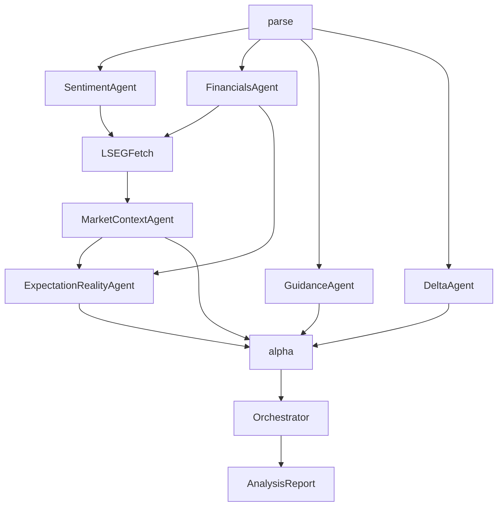

# MAECAS Dashboard Methodology Report

## Executive Overview

MAECAS, the Multi-Agent Earnings Call Analysis System, is a local earnings intelligence application that turns a Refinitiv StreetEvents earnings call transcript into a structured investment research dashboard. The application is not designed as a generic transcript summarizer. Its purpose is to convert a long, noisy, management-controlled corporate event into a repeatable analytical workflow that helps an investor understand what was said, how it was said, what changed versus expectations, and which claims matter enough to influence an investment thesis.

The central philosophy of MAECAS is separation of judgment. An earnings call contains many different kinds of information: stated financial numbers, management tone, analyst skepticism, forward guidance, market expectations, consensus estimates, quarter-over-quarter language changes, and hidden risks. If all of that is compressed into one undifferentiated summary, the user loses the ability to inspect the reasoning. MAECAS instead decomposes the work into specialized modules and then recombines them into a dashboard. Each module answers a narrow question, exposes its own evidence, and contributes to the final thesis only after its output has been structured.

The dashboard shown in the example PDF reflects this philosophy. It begins with a Core Thesis because users need a decision-shaped summary, but the rest of the interface immediately decomposes that thesis into its sources: market alignment, transcript scorecard, ranked trading signals, financial figures, LSEG market context, management language, catalysts, quarter-over-quarter deltas, and narrative warnings. The report is therefore both a product interface and a methodology statement. It shows not only what MAECAS concluded, but also how the conclusion was assembled.

From a business perspective, the application is built for decision support. It helps an analyst or investor shorten the time from transcript receipt to investment interpretation. It does not replace analyst judgment, and its Buy, Monitor, or Avoid output should not be treated as an autonomous trading instruction. The correct use of the dashboard is to identify the thesis, inspect the evidence, compare the output with one's own model and market view, and then decide whether the call changed the investment case.

## End-to-End Application Flow

The user journey begins with a transcript upload. The required input is a current-quarter Refinitiv StreetEvents XML transcript. The user may also upload a prior-quarter XML transcript, which enables the quarter-over-quarter comparison module. Once the current transcript is submitted, the frontend sends the file to the FastAPI backend. The backend creates a job, stores the queued state in SQLite, starts the LangGraph pipeline as a background task, and streams progress events back to the browser through server-sent events.

The frontend is intentionally simple from a navigation standpoint. It is a single-page application with three states: upload, progress, and dashboard. This keeps the workflow linear. The user does not browse routes or manually request intermediate files. The application takes responsibility for moving from file selection to pipeline status to final report display.

```mermaid
flowchart LR
  user[User] --> upload[UploadCurrentXML]
  upload --> api[FastAPIStartJob]
  api --> db[(SQLiteJobStore)]
  api --> graph[LangGraphPipeline]
  graph --> report[AnalysisReportJSON]
  report --> db
  api --> stream[SSEProgressStream]
  stream --> frontend[ReactProgressView]
  db --> dashboard[ReactDashboard]
```

The same flow can also be read as a chain of responsibility. Each layer takes ownership of a narrower part of the problem, which keeps the dashboard explainable.

| Layer | Main Responsibility | Primary Artifacts | User-Facing Result |
|---|---|---|---|
| User interface | Collect transcript files, show job progress, render the final dashboard | `Upload`, `Progress`, dashboard panels | A guided workflow from XML upload to report review |
| API and persistence | Validate uploads, create jobs, stream progress, store completed reports | FastAPI routes, SSE manager, SQLite `AnalysisJob` | Visible job state and retrievable historical results |
| Parsing layer | Convert Refinitiv XML into structured transcript evidence | `TranscriptData`, `TranscriptMetadata`, `Utterance` | Clickable citations and section-aware analysis |
| Agent pipeline | Run specialized analysis modules over the transcript and market data | Sentiment, financials, market, guidance, delta, signals | Modular analytical sections rather than one opaque summary |
| Synthesis layer | Assemble the final report, audit citations, classify warnings | `AnalysisReport` | A coherent investment dashboard with traceable evidence |

The backend report contract is the `AnalysisReport` schema. It carries the full output needed by the interface: transcript metadata, sentiment analysis, stated financials, market context, LSEG data, guidance and catalysts, quarter-over-quarter delta, trading signals, composite scores, narrative sections, expectation-versus-reality analysis, hidden gems, thesis memory, warnings, risk flags, and the full structured transcript utterances used for citations.

This contract matters because the application is designed around traceability. The dashboard does not render an opaque blob of text. It renders a typed report where each component receives the field that belongs to its analytical job. The Core Thesis panel receives trading signals. The Financials panel receives stated financials. The Sentiment panel receives linguistic analysis. The Transcript Drawer receives the utterance list. This design lets the product evolve module by module without losing the ability to explain where a conclusion came from.

## Source Data and Transcript Parsing

MAECAS is built around Refinitiv StreetEvents XML transcripts. According to the StreetEvents guide included with the repository, these files contain metadata, a transcript body, and closing metadata. The transcript body normally separates the prepared presentation from the question-and-answer section. This structure is important because the application treats the two sections differently. A prepared management script reveals the company's chosen narrative; Q&A reveals where analysts push, where management has to improvise, and where specificity breaks down.

The parser in `backend/services/xml_parser.py` performs deterministic work before any LLM-based analysis begins. It extracts the event ID, company name, ticker, RIC, CUSIP, ISIN, event type, event date, update date, and related metadata. It then separates presentation text from Q&A text using StreetEvents section markers. Within each section, it identifies speaker turns and classifies speakers into roles such as CEO, CFO, Analyst, Operator, or Unknown. Finally, it re-indexes utterances globally so every later citation can point back to a stable transcript location.

This parser is deliberately not an interpretive agent. It does not decide whether a statement is bullish or bearish. It creates the evidence substrate. That design choice is important because every downstream model output relies on the transcript being cleanly segmented. When the UI later opens a citation in the Transcript Drawer, it is using these parsed utterance indexes rather than a loose text search or invented quote.

The optional prior-quarter transcript is parsed in the same way. Its purpose is comparative rather than primary. When present, it allows the pipeline to distinguish a genuinely new topic from one management has repeated for several quarters. Without the prior transcript, MAECAS can still analyze the current call, but it cannot make the same claims about drift, newly introduced risks, or de-emphasized topics.

## Backend Analytical Pipeline

The analytical backend is a LangGraph pipeline defined in `backend/graph/pipeline.py`. Its shape reflects a research process. First, the transcript is parsed. Then independent agents analyze different dimensions of the call. Market data is fetched after the system knows the company identity and event date. Expectation-versus-reality analysis runs after market context and financial extraction are available. Finally, the alpha agent builds decision-relevant signals, and the orchestrator assembles the finished report.



The pipeline can be summarized as a progression from evidence creation to investment synthesis. The parser creates the evidence base. The middle agents analyze distinct dimensions of that evidence. The alpha agent turns those dimensions into ranked investable claims. The orchestrator then packages the final dashboard without erasing the provenance of each claim.

| Pipeline Module | Input It Depends On | Question It Answers | Main Output |
|---|---|---|---|
| Parser | Current XML, optional prior XML | What is the structured transcript evidence? | Metadata, utterances, presentation text, Q&A text |
| Sentiment | Parsed presentation and Q&A utterances | How confident, hedged, skeptical, or evasive was the call? | `SentimentProfile` |
| Financials | Parsed transcript | What numbers did management explicitly state? | `StatedFinancials` |
| LSEG fetch | Transcript metadata and event date | What external market data is available for this issuer? | `LSEGMarketData` |
| Market context | Stated financials and LSEG data | How do transcript facts compare with market data and consensus? | `MarketContext` |
| Guidance | Parsed transcript | What future events, ranges, or implicit signals did management provide? | `GuidanceCatalysts` |
| Delta | Current and prior transcript, sentiment | What changed versus the prior quarter? | `QoQDelta` |
| Expectation | Transcript, financials, market context, consensus | What did the market expect, and what changed? | `ExpectationReality` |
| Alpha | Sentiment, market, guidance, delta, expectation | Which claims matter enough to drive a decision? | `TradingSignals` |
| Orchestrator | All upstream outputs | How should the final dashboard be assembled and caveated? | `AnalysisReport` |

The parser agent is the first module and is deterministic. It transforms raw XML into `TranscriptData`, which contains metadata, utterances, presentation text, and Q&A text. It is the only stage that should understand the quirks of the Refinitiv XML format.

The sentiment agent analyzes language rather than numbers. Its prompt explicitly prevents it from extracting financial figures or making trading recommendations. It scores management confidence in the presentation, management confidence in Q&A, hedging frequency, analyst skepticism, and evasion at the Q&A exchange level. Its business question is: how did management communicate, and where did their language become less direct?

The financials agent extracts stated figures. Its responsibility is narrow: capture numbers that management explicitly provided, such as revenue, gross margin, EPS, cash flow, capital expenditure, or guidance ranges. The application separates this from market comparison because a stated figure and an investment implication are not the same thing.

The LSEG and market context modules enrich the transcript with external data. When LSEG is available, the system can fetch instrument metadata, price history, fundamentals, consensus estimates, estimate surprises, estimate revisions, and other relevant market data. The market context agent then compares transcript-derived financials with these external anchors. This lets the dashboard distinguish between a number that looks large in isolation and a number that actually beat or missed expectations.

The guidance agent extracts forward-looking information. It looks for explicit ranges, qualitative commitments, catalysts, timelines, invalidation triggers, and implicit signals. Its business question is: what future events did management put on the table, and what would need to happen for those events to matter?

The delta agent runs only when a prior transcript is available. It compares topics, sentiment, guidance specificity, risk keywords, and language drift. It also combines model judgment with deterministic phrase drift, including hedging and certainty changes. Its role is to stop the user from treating every current-quarter statement as equally new.

The expectation agent compares what the market expected before the call with what the transcript revealed after the call. It uses LSEG consensus and pre-call context where available. This module is central to the investment philosophy of the application because market impact depends on surprise, not just absolute quality.

The alpha agent synthesizes the upstream objects into ranked bull and bear signals. It assigns claim type, novelty, priority tier, priced-in assessment, time horizon, P&L linkage, confidence, numeric anchors, and risk tags. It also creates the canonical Core Thesis. The code enforces a maximum of three primary signals and validates that the Core Thesis references real signal IDs. This is a safeguard against a model producing a thesis that is not grounded in its own signal stack.

The orchestrator is the final synthesis agent. It receives the structured outputs and produces composite scores, narrative sections, hidden gems, warning classifications, and the final `AnalysisReport`. It also audits citations, deduplicates warnings, and separates model uncertainty from thesis-relevant risk flags. Its purpose is integration, not reinvention. It is explicitly instructed not to re-read the raw transcript or duplicate the work of the signals panel.

## Dashboard Composition

The dashboard is composed in `frontend/src/App.tsx`. Once the report is loaded, the application wraps the dashboard in a `TranscriptProvider` and a `DedupRegistryProvider`. This matters because the interface is evidence-first and repetition-aware. The transcript provider gives citation buttons access to the full utterance list, while the deduplication registry helps prominent facts appear in the right place without being repeated across every panel.

The visible panel order is deliberate. The dashboard starts with the final thesis, then immediately explains the market expectation gap, then provides compact transcript diagnostics, then moves into the signal stack and supporting evidence. Financials and LSEG data ground the thesis in numbers. Sentiment and analyst intelligence explain the language of the call. Catalysts and deltas show how the thesis may evolve. The final narrative section captures what changed, what was downplayed, hidden gems, warnings, and risk flags.

This order mirrors how a professional investor might read a call note. First, they want the conclusion. Then they want to know whether it is surprising. Then they want the evidence, the numbers, the tone, the forward path, and the risks.

The following table gives a compact map of the user interface. The later sections explain each panel in prose, but this view helps show how the dashboard modules fit together.

| Dashboard Panel | Primary Input | Processing Method | Output Seen by User | Investment Purpose |
|---|---|---|---|---|
| Upload | Current XML, optional prior XML | File validation and job creation | Upload form and selected files | Defines the evidence set |
| Progress | SSE events | Agent status mapping | Pipeline progress and stage status | Makes analysis execution transparent |
| Core Thesis | `TradingSignals.core_thesis` | Signal ID lookup and deduplication | Decision, conviction, bull case, bear case, falsifiers | States the investable view |
| Expectation vs Reality | `ExpectationReality` | Consensus and transcript comparison | Market expected, what changed, what market is missing | Frames surprise versus prior beliefs |
| Transcript Scorecard | Sentiment, guidance, delta, risks | Ordinal transformation | Tone, hedging, evasion, specificity, risk density | Gives a fast behavioral read |
| Trading Signals | Bull and bear signals | Tiering by decision relevance | Primary and secondary signal stack | Converts evidence into alpha claims |
| Financials | `StatedFinancials` | Stated-number rendering | Key figures and units | Preserves the factual number layer |
| LSEG Market Data | `LSEGMarketData`, `MarketContext` | Consensus, surprise, revision, and coverage formatting | Market data and context blocks | Grounds the call in external expectations |
| Sentiment Intelligence | `SentimentProfile` | Tone and evasion grouping | Management tone, analyst concerns, deflections | Assesses credibility and pressure |
| Catalysts and Guidance | `GuidanceCatalysts` | Timeline and probability bucketing | Catalysts, impact, invalidation triggers | Turns forward language into a monitor list |
| QoQ Comparison | `QoQDelta` | Topic and language drift analysis | New, repeated, and dropped themes | Detects narrative change |
| Delta Notes | Narrative, hidden gems, warnings | Non-redundant synthesis and warning split | What changed, downplayed issues, hidden threads | Explains overlooked implications |
| Transcript Drawer | Structured utterances | Citation index lookup | Source quote and surrounding context | Lets users audit claims |

## Upload Panel

The Upload panel is the user's entry point into the system. It receives the current-quarter transcript and, optionally, a prior-quarter transcript. Its technical function is straightforward: validate file selection, ensure XML input, call the backend start endpoint, and hand the returned job ID to the application state machine.

Its methodological function is more important than it first appears. By requiring a current transcript and making the prior transcript optional, MAECAS separates current-call interpretation from change analysis. The current transcript is enough to produce sentiment, financial extraction, guidance, market context, and trading signals. The prior transcript adds a second analytical dimension: whether management's topics, tone, risks, or specificity changed.

The user sees a simple upload interface rather than a data configuration screen. This reflects a product choice. The application is meant to make transcript intelligence accessible quickly. The complexity is pushed into the pipeline, where each module knows which part of the transcript and which external data it needs.

## Progress Panel

The Progress panel renders the analysis job as a staged process. It listens to server-sent events from the backend and displays agent-level progress. The user sees whether the system is parsing, analyzing sentiment, extracting financials, fetching market data, generating signals, or synthesizing the final report.

This panel is valuable because the pipeline can take time, especially when LLM calls and LSEG requests are involved. Without progress visibility, the product would feel like a black box. With progress visibility, the user can see the analytical sequence and understand that the dashboard is not a single model completion.

The progress view also reinforces trust. If a stage is skipped or fails, the system can surface that fact through warnings rather than silently pretending all data was available. That is consistent with the broader MAECAS philosophy: degraded but transparent output is preferable to polished output with hidden gaps.

## Core Thesis Panel

The Core Thesis panel is the top of the dashboard and the most compressed expression of the analysis. It receives `report.signals`, especially `core_thesis`, from the alpha agent. It displays the one-line thesis, decision, conviction, time horizon, bull case, bear case, key driver, key risk, and falsification triggers.

Technically, the panel looks up the signal IDs referenced by the Core Thesis. This creates a link between the headline conclusion and the underlying signal stack. The thesis is not allowed to float separately from the evidence. If the alpha agent says that a certain risk is the key risk, that risk should correspond to an actual bear signal with citations, confidence, novelty, and P&L linkage.

Business-wise, the Core Thesis panel answers the first question an investor asks after a call: what is the investable interpretation? The answer is deliberately framed as a debate rather than a slogan. A good earnings-call thesis should include both the bull case and the bear case because markets price uncertainty. The panel also includes “what would change this view,” which turns the conclusion into a falsifiable thesis. That is a major methodological choice. The system is not only producing a recommendation; it is defining the conditions under which the recommendation should be reconsidered.

In the example PDF, the Core Thesis for Intel describes a high-friction supply phase caused by depleted inventories, balanced against capital discipline and advanced packaging upside. The decision is Monitor, not an aggressive directional call. That illustrates how the system can produce a nuanced conclusion even when the transcript contains both positive strategic signals and near-term operational stress.

## Market Alignment: Expectation Versus Reality

The Expectation vs Reality panel explains the pre-call market setup and the post-call information gap. It receives `report.expectation_reality`, which is produced after the system has access to transcript evidence, stated financials, LSEG consensus, and market context. If the expectation object is unavailable, the panel does not render, which is appropriate because expectation comparison depends on data availability.

The panel's input includes a pre-call market narrative, consensus snapshot, what changed, what the market may be missing, delta magnitude, citations, and methodology. It displays market expectations in prose, then shows specific deltas. The distinction matters. Many earnings-call summaries describe what management said. This panel asks whether what management said changed the market's prior belief.

From a business perspective, this is one of the most important modules. Stock prices react to surprise and revised expectations. A company can report strong numbers and still disappoint if expectations were higher. It can also report weak near-term numbers but create upside if the market missed an emerging catalyst. The panel therefore frames the transcript as an expectation-updating event.

In the Intel example, the market expected turnaround stabilization, PC recovery, AI PC benefits, and execution of the manufacturing roadmap. What changed was the revelation of severe supply constraints, depleted buffer inventory, a packaging-led foundry narrative, quantified yield improvement, and the operational reality of being “hand to mouth.” The panel shows that the important question is not merely whether Intel's results beat consensus, but whether the call changed the shape of the forward thesis.

## Transcript Scorecard

The Transcript Scorecard is a compact diagnostic panel. It receives the full report and computes five user-facing dimensions: tone, hedging, evasion, guidance specificity, and risk density. These are derived from upstream sentiment, delta, guidance, risk, and signal fields, but the panel translates them into ordinal labels rather than exposing raw scores as if they were precise measurements.

This is a subtle but important design choice. LLM-generated or rubric-based scores can be useful internally, but they should not pretend to be exact financial measurements. By showing labels such as Mixed, Some hedging, Notable, Heavy, or Low, the UI communicates direction and severity without overclaiming precision.

The scorecard gives the user a quick read on the transcript's behavioral texture. Tone tells whether management sounded confident or strained. Hedging indicates how much management relied on qualifiers. Evasion highlights whether analysts asked questions that management did not answer directly. Guidance specificity tells whether management gave concrete ranges or vague direction. Risk density indicates how much the transcript and signal stack are carrying identifiable risks.

The business value is speed. Before reading every panel, the user can understand the character of the call. Was this a clean beat with confident management? A defensive call with analyst pressure? A guidance-heavy call with new risks? The scorecard gives that first structured impression.

## Trading Signals Panel

The Trading Signals panel is where transcript evidence becomes investable signal structure. It receives `report.signals`, including bull signals, bear signals, reasoning chain, balance assessment, and signal methodology. The alpha agent creates these signals after receiving sentiment, market context, guidance, expectation-versus-reality output, and delta analysis.

Each signal is more than a sentence. It carries a claim type, such as fact, inference, or speculation. It carries novelty status, such as new, repeated, de-emphasized, or resolved. It has citations, confidence, a rationale, optional numeric anchor, risk tags, priority tier, time horizon, P&L linkage, and priced-in assessment. This design forces the signal to answer several professional research questions: Is it grounded? Is it new? Does it affect revenue, margin, multiple, capex, or mix? Is it already priced? Over what horizon does it matter?

The UI organizes signals into primary, secondary, and noise tiers. Primary signals are the few claims that actually drive the decision. Secondary signals are real but supporting. Noise signals may be true but are not decision-relevant. The code also suppresses signals already elevated in the Core Thesis so the dashboard does not repeat itself.

The business philosophy is that not every true statement is an alpha signal. Earnings calls contain dozens of facts, but only a small number matter for the investment case. A statement becomes a signal when it changes expectations, affects future financial outcomes, has evidence, and can be placed on a time horizon. The panel is designed to discipline that conversion.

In the example PDF, the signal stack distinguishes between primary and secondary ideas. The core driver and risk are not simply repeated; the panel focuses on other decision-relevant signals, such as capital discipline around the 14A node, yield improvement velocity, gross margin trough, and external component pricing pressure.

## Financials Panel

The Financials panel receives `report.financials`, especially the list of stated figures extracted from the transcript. It displays key numbers directly, including labels, values, units, periods, and year-over-year changes when available. It intentionally shows stated figures rather than treating every extracted number as a market conclusion.

This panel exists because financial extraction and financial interpretation are different jobs. If management says revenue was $13.7 billion, that statement belongs in the financials module. Whether that number beat consensus, changes guidance, or affects the thesis belongs elsewhere. By keeping the Financials panel factual, the dashboard preserves a clean evidence layer.

The business value is reliability. Analysts often need a fast view of what management explicitly reported or guided. The panel answers that need without mixing in tone, sentiment, or alpha. It is the numerical anchor for the rest of the dashboard.

In the Intel PDF, the panel shows figures such as Q4 revenue, non-GAAP gross margin, non-GAAP EPS, operating cash flow, gross capex, adjusted free cash flow, NVIDIA investment, and full-year revenue. Those numbers provide the factual base from which market comparison and thesis interpretation can proceed.

## LSEG Market Data and Context Panel

The LSEG Market Data panel receives `report.lseg_data`, `report.market`, and transcript metadata. It shows whether LSEG is available, which data blocks were populated, the resolved instrument identity, consensus estimates, actual-versus-estimate snapshots, estimate revisions, revenue history, analyst recommendation summary, beat/miss flags, and computed metrics.

The processing behind this panel is hybrid. Some of it is deterministic market data retrieval through the LSEG Data Library. Some of it is model-assisted synthesis in the market context agent. The system is designed to fail softly. If LSEG is unavailable or a particular block cannot be fetched, the dashboard should still render transcript-based analysis and disclose the coverage gap.

The business purpose is to prevent transcript analysis from becoming context-free. Management's statements need to be compared against consensus, price behavior, fundamentals, and revisions. A company may sound confident, but if guidance is below consensus, that matters. A company may report an EPS beat, but if revenue quality is weak or estimates were already revised down, the interpretation changes.

The panel also makes data coverage visible. In the example PDF, the dashboard states that the LSEG session is active and that five of six blocks are available, while estimate revisions are unavailable. This is exactly the kind of transparency a financial tool needs. The absence of data is itself information about confidence.

## Sentiment and Analyst Intelligence Panel

The Sentiment and Analyst Intelligence panel receives `report.sentiment`. It displays management confidence in the presentation and Q&A, hedging frequency, analyst skepticism, top analyst concerns, deflected questions, confidence rationale, methodology, and evidence citations.

The panel's methodology rests on the idea that an earnings call is both an information event and a rhetorical event. The prepared remarks are controlled by management. The Q&A is less controlled and often more revealing. Management may sound confident in the presentation but become vague when analysts ask about margin bridges, demand normalization, inventory quality, pricing, or capital allocation.

The evasion scoring is especially important. The sentiment agent scores Q&A exchanges from direct answers to explicit non-answers. It also records question quality, topic, analyst name, and reason. The UI then surfaces the highest-concern topics and examples where management deflected. This is not meant to punish management for every qualitative answer; it is meant to identify where analysts asked for specificity and did not receive it.

Business-wise, the panel helps the user understand transcript risk that may not appear in financial figures. A company can beat estimates and still reveal stress through hedging, topic avoidance, or defensive answers. Conversely, a difficult quarter may be less concerning if management is specific, direct, and consistent under analyst pressure.

In the Intel example, the panel highlights analyst concerns around unconstrained demand, gross margins, and inventory management. It shows direct examples where analysts asked for precision and management answered in a less quantified way. That gives the user evidence for assessing credibility and forecast risk.

## Catalysts and Guidance Panel

The Catalysts and Guidance panel receives `report.guidance`. It displays explicit guidance, implicit signals, catalysts, timelines, magnitude estimates, probability buckets, expected impact, invalidation triggers, citations, and surprise gap methodology.

The panel is forward-looking by design. Earnings calls are not only reports on the past quarter. They are opportunities for management to reset expectations about future demand, margin recovery, capital intensity, product launches, customer commitments, supply constraints, regulatory events, and strategic pivots. The guidance agent extracts those future-facing claims and organizes them as monitorable catalysts.

The invalidation triggers are a particularly important design element. A catalyst is not useful unless the user knows what would make it fail. By showing what would make the catalyst wrong, the panel turns narrative optimism into a testable forecast. This aligns with the Core Thesis panel's falsification philosophy.

Business-wise, this panel helps investors convert call commentary into a watchlist. Instead of vaguely remembering that management sounded positive about the second half, the user can track specific events, timelines, probabilities, and evidence. In the Intel PDF, examples include foundry customer decision windows, advanced packaging revenue ramps, supply constraint normalization, and long-term 14A commercial production.

## Quarter-over-Quarter Comparison Panel

The Quarter-over-Quarter Comparison panel receives `report.delta`, which exists only if a prior-quarter transcript was supplied. It organizes topics by novelty status and displays language drift, added phrases, removed phrases, hedging drift, certainty drift, guidance specificity delta, and new risk keywords.

This panel's core methodology is comparative. A topic that appears in one call may be important, but a topic that newly appears, disappears, or changes tone can be more important. Management teams often shift emphasis gradually. They may introduce a new constraint, stop discussing a prior growth driver, use less certain language, or become more specific about guidance. Those changes can be early indicators of thesis evolution.

The panel separates newly mentioned topics, topics mentioned in both periods, and no-longer-mentioned topics. It also shows phrase-level drift, such as what management started saying and stopped saying. This is valuable because language changes can reveal priorities before formal guidance changes.

Business-wise, the panel helps users avoid recency bias. A single transcript can sound dramatic, but the real question is whether it represents a change. If a risk has been discussed for several quarters, it may already be priced. If a risk appears for the first time, it may deserve more attention. If management stops discussing a previously emphasized catalyst, that omission may matter.

## Delta Notes and Narrative Synthesis

The Delta Notes and narrative section is rendered through `WhatChangedPanel`. It receives orchestrator narrative sections, hidden gems, model warnings, and risk flags. It intentionally avoids duplicating the Core Thesis and Trading Signals panels. The orchestrator prompt instructs it to return only two narrative sections: what changed and what management downplayed.

This section is the reflective layer of the dashboard. It does not try to restate every metric. Instead, it explains the non-redundant interpretation of the call. “What changed” describes the main differences versus expectations or prior framing. “What management downplayed” identifies topics that management did not emphasize but that may matter for the investment case.

Hidden gems are also surfaced here. These are statements mentioned only once or buried in the transcript but potentially important. The hidden-gem concept is useful because earnings calls often contain one-off comments that reveal strategic timing, customer behavior, cost pressure, or management constraints. A traditional summary may miss them because they were not repeated.

The section also separates model warnings from risk flags. Model warnings are about analytical uncertainty: missing citations, skipped agents, low confidence, or unavailable data. Risk flags are about the company or investment thesis: fragile assumptions, execution risk, margin pressure, supply constraints, accounting issues, or other substantive concerns. This distinction helps the user know whether a warning reduces trust in the model output or increases concern about the business itself.

## Transcript Drawer and Evidence Citations

The Transcript Drawer is an overlay rather than a normal dashboard card, but it is central to the application's trust model. It receives the parsed transcript utterances through the transcript context. When a user clicks a citation button, the drawer opens a small window around the cited utterance and shows speaker, role, section, and text.

The drawer turns citations into a first-class interaction. A citation is not just a decorative footnote. It is a way to audit whether the model's claim is supported by the transcript. Because utterances are globally indexed during parsing, the UI can open the relevant evidence without searching the raw XML.

Business-wise, this is essential for analyst adoption. Investors need to trust but verify. A dashboard that makes strong claims without click-through evidence would be difficult to rely on. By making the transcript accessible at the claim level, MAECAS encourages the user to inspect the source before accepting the interpretation.

## Confidence, Warnings, and Graceful Degradation

MAECAS is designed to be useful even when some data is missing, but it should not hide those gaps. If LSEG credentials are unavailable, the app can still run the transcript analysis. In that case, price charts, consensus comparisons, estimate revisions, or beat/miss flags may be empty or limited. If no prior transcript is uploaded, the delta view is absent. If an agent produces low confidence or a citation audit finds missing support, warnings are propagated into the final report.

The system's philosophy is graceful degradation with disclosure. A failed market data block should not destroy the transcript analysis. A missing prior quarter should not prevent the user from reading the current call. But the dashboard should make the absence clear so the user does not overinterpret incomplete output.

This is why the final report includes both `pipeline_warnings` and classified warning fields. The orchestrator separates model warnings from risk flags so the user can distinguish uncertainty about the analysis from risk embedded in the company story.

## Technical Design Philosophy

Technically, MAECAS uses typed schemas to keep the frontend and backend aligned. The backend Pydantic schemas define domain objects such as `SentimentProfile`, `StatedFinancials`, `MarketContext`, `GuidanceCatalysts`, `QoQDelta`, `TradingSignals`, `ExpectationReality`, and `AnalysisReport`. The frontend mirrors these contracts in TypeScript. This reduces ambiguity between model output, API response, and UI rendering.

The use of LangGraph reflects the need for dependency-aware orchestration. Some agents can run after parsing. Others need market data or upstream analysis. The graph structure makes those dependencies explicit. This is better than a single long sequential script because it clarifies which analytical modules depend on which inputs.

The prompt files under `backend/prompts` are part of the application logic. They define role boundaries, rubrics, output schemas, and reasoning requirements. For example, the sentiment prompt defines management confidence, hedging, evasion, and analyst skepticism rubrics. The alpha prompt defines how to classify signal priority, time horizon, priced-in assessment, and P&L linkage. The orchestrator prompt defines how to avoid narrative duplication and how to classify warnings.

The frontend design complements this backend structure. Each dashboard component maps to a domain object rather than recomputing everything locally. Components do perform presentation-level transformations, such as ordinal labels, formatting, grouping, and deduplication, but the substantive analytical outputs come from the pipeline.

## Business Methodology

The business methodology behind MAECAS can be summarized as expectation-aware transcript intelligence. The system assumes that the investment value of an earnings call lies in the gap between prior expectations and newly revealed information. That gap can appear in numbers, but it can also appear in tone, specificity, analyst pressure, omitted topics, new risks, or changing timelines.

The application therefore treats the transcript as a layered evidence source. The first layer is what management explicitly stated. The second layer is how management stated it. The third layer is how analysts challenged it. The fourth layer is how it compares with consensus and market data. The fifth layer is how it compares with prior calls. The final layer is whether the resulting evidence changes the investment thesis.

This structure helps avoid two common errors in earnings analysis. The first error is narrative overreach, where a summary turns a few comments into a strong investment conclusion without enough grounding. MAECAS counters this with citations, typed signals, confidence, and falsifiers. The second error is data myopia, where analysis focuses only on reported numbers and misses tone, evasiveness, or changing emphasis. MAECAS counters this with sentiment, Q&A intelligence, delta analysis, and hidden-gem detection.

The dashboard is also designed to distinguish fact from inference. A stated revenue number is a fact. A claim that management is shifting capital discipline is an inference if it synthesizes several statements. A long-term market-share implication may be more speculative. By carrying claim type through signals and narrative claims, the application helps users assign the right level of confidence to each idea.

## How to Read the Dashboard

A user should begin with the Core Thesis to understand the final interpretation, but should not stop there. The next step is to inspect Expectation vs Reality because it explains whether the thesis is based on a genuine surprise or merely a restatement of known issues. The Transcript Scorecard then gives a quick read on the call's tone and risk texture.

After that, the Trading Signals panel should be read as the decision engine. The user should pay attention to which signals are primary, which are secondary, and whether the key claims are facts, inferences, or speculation. The Financials and LSEG panels should then be used to test the numerical and market grounding of those signals.

The Sentiment panel is useful for checking management credibility and analyst pressure. The Catalysts panel should be treated as the monitoring framework for future quarters. If a prior transcript was uploaded, the Quarter-over-Quarter Comparison panel should be used to identify which parts of the story are truly new. Finally, the narrative and warning section should be read for omissions, hidden threads, model limitations, and business risks.

The best use of MAECAS is iterative. The dashboard gives a structured first pass, but a serious user should click citations, compare the claims to their own model, and decide whether the thesis changes their view.

## Conclusion

MAECAS turns earnings-call transcripts into a structured decision-support workflow. It begins with Refinitiv XML, parses the transcript into evidence, runs specialized agents over language, financials, market context, guidance, deltas, and expectations, and then synthesizes the result into a dashboard organized around investment relevance.

The application's strength is not simply that it uses multiple agents. Its strength is that each agent has a defined analytical role, each dashboard panel has a clear input-process-output relationship, and the final report remains connected to transcript evidence. The methodology is designed for analysts who need speed but cannot sacrifice traceability.

In practical terms, MAECAS answers a sequence of questions that mirror the work of earnings research: What did management say? What numbers were stated? How confident or evasive was management? What did analysts challenge? What did the market expect? What changed? What is still missing from the market's view? What catalysts matter next? What changed versus last quarter? What are the bull and bear signals? What thesis should be monitored, and what would falsify it?

That sequence is the real product. The dashboard is the interface, but the methodology is the conversion of unstructured corporate speech into a disciplined, evidence-backed investment interpretation.
