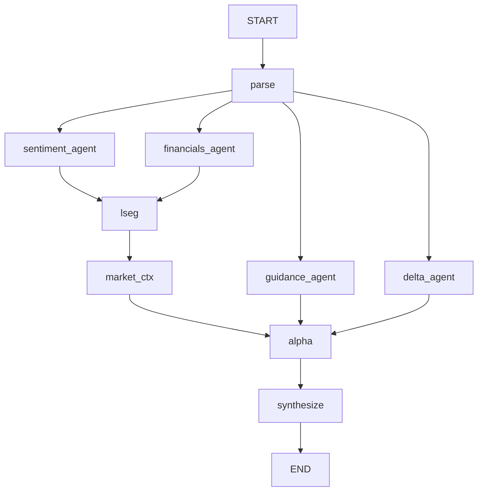
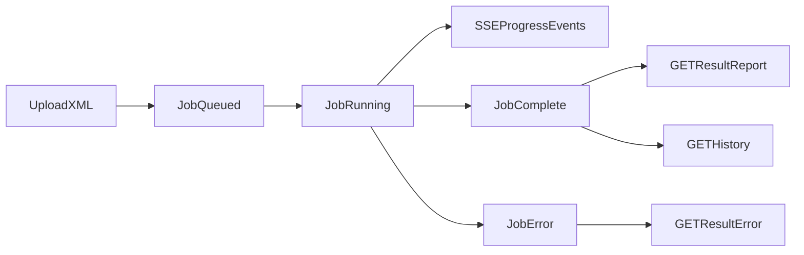

# MAECAS Context Guide (Full-App Understanding)

This document is a deep technical guide to the repository, intended to work like a "super README" for contributors. It explains what the app does, how it is built, how data flows through it, and where to edit for specific behavior changes.

---

## 1) Overview

### What this repo is about

This repository contains **MAECAS** (Multi-Agent Earnings Call Analysis System): a local web application that ingests Refinitiv StreetEvents transcript XML files and converts them into a structured investment-analysis report.

At a high level:
- Input: one required current-quarter transcript XML, one optional prior-quarter XML.
- Processing: an 8-agent LangGraph pipeline (parser + analysis agents + synthesis agent).
- Output: a dashboard with sentiment, financial extraction, guidance/catalysts, market context, quarter-over-quarter deltas, trading signals, and narrative commentary.

### What problem it solves

Earnings call transcripts are long, noisy, and time-consuming to analyze manually. MAECAS reduces analyst effort by:
- Parsing and structuring transcript content.
- Running specialized agent analyses with clear role boundaries.
- Optionally enriching transcript intelligence with market data (LSEG).
- Producing a consistent, explainable report format for decision support.

### Goal and boundaries

The goal is to deliver **fast, structured, repeatable call intelligence**.  
This app supports analysts; it does not replace analyst judgment. The "Buy/Monitor/Avoid" action is a model output and should be treated as decision support, not autonomous execution.

---

## 2) Features / Functionality

### Capability map

| Feature | Backend module(s) | Frontend surface | Primary output fields |
|---|---|---|---|
| Transcript XML parsing | `maecas/backend/services/xml_parser.py`, `maecas/backend/agents/agent_01_parser.py` | Upload flow and downstream screens | `metadata`, `utterances`, `presentation_text`, `qa_text` |
| Sentiment/rhetoric analysis | `agent_02_sentiment.py`, `prompts/agent_02_sentiment.yaml` | `SentimentPanel` | `sentiment.*` |
| Financial extraction (explicitly stated only) | `agent_03_financials.py`, `prompts/agent_03_financials.yaml` | `FinancialsChart` | `financials.figures`, `financials.guidance_ranges`, `financials.declined_to_quantify` |
| LSEG market fetch + market-context inference | `agent_04_market.py`, `services/lseg.py`, `prompts/agent_04_market.yaml` | `PriceChart` and market sections in cards/reports | `lseg_data.*`, `market.*` |
| Guidance and catalysts | `agent_05_guidance.py`, `prompts/agent_05_guidance.yaml` | `CatalystTimeline` | `guidance.*` |
| QoQ transcript delta (optional) | `agent_06_delta.py`, `prompts/agent_06_delta.yaml` | `DeltaView` | `delta.*` |
| Signal generation | `agent_07_alpha.py`, `prompts/agent_07_alpha.yaml` | `SignalFeed`, `RatingCard` | `signals.*` |
| Final synthesis + narrative | `agent_08_orchestrator.py`, `prompts/agent_08_orchestrator.yaml` | `NarrativeReport`, global dashboard | `composite_scores`, `narrative`, `pipeline_warnings` |

### API services provided

| Method | Endpoint | Business purpose |
|---|---|---|
| `POST` | `/api/analysis/start` | Start new analysis job from uploaded XML(s) |
| `GET` | `/api/analysis/{job_id}/stream` | Stream real-time pipeline progress via SSE |
| `GET` | `/api/analysis/{job_id}/result` | Fetch final report (or in-progress/error status) |
| `GET` | `/api/analysis/history` | List historical jobs from SQLite |
| `DELETE` | `/api/analysis/{job_id}` | Remove a historical job |
| `GET` | `/api/health` | Check API + LSEG + LLM credential readiness |

### Business-logic structuring principle

The pipeline is deliberately decomposed into narrowly scoped agents. Prompt files enforce role boundaries so one agent does not "do another agent's job" (for example, sentiment agent does not produce trading recommendations).

---

## 3) User Perspective

### User journey

1. User opens UI (`frontend` app) and lands on upload screen.
2. User uploads required current transcript (`.xml`) and optional prior transcript.
3. App starts job and switches to progress view.
4. User sees live agent-by-agent status updates from SSE stream.
5. When complete, dashboard loads with report sections.
6. User can reset and run another transcript.

### What users should expect

- **Validation behavior:** only `.xml` is accepted; upload size is capped (`max_upload_size_mb`).
- **Optional prior transcript:** if omitted, delta agent is skipped and `DeltaView` is effectively absent.
- **No LSEG credentials/session:** app still works, but price/consensus-related content is limited or empty.
- **Transparent confidence/warnings:** low-confidence outcomes are propagated into `pipeline_warnings`.
- **Error mode:** if pipeline fails, UI surfaces error and allows retry from upload view.

### View-state model (frontend)

The frontend is a single-page state machine (`upload -> progress -> dashboard`), not route-driven pages. This keeps the job flow linear and easier to reason about.

---

## 4) Architecture

### System architecture diagram

```mermaid
flowchart LR
  user[User] --> frontend[ReactFrontend]
  frontend -->|POST start| api[FastAPIAPI]
  frontend -->|SSE stream| api
  frontend -->|GET result/history| api

  api --> db[(SQLite analysis_jobs)]
  api --> graph[LangGraphPipeline]

  graph --> parser[Agent01Parser]
  graph --> sentiment[Agent02Sentiment]
  graph --> financials[Agent03Financials]
  graph --> marketFetch[Agent04LsegFetch]
  graph --> marketCtx[Agent04MarketContext]
  graph --> guidance[Agent05Guidance]
  graph --> delta[Agent06Delta]
  graph --> alpha[Agent07Alpha]
  graph --> synth[Agent08Orchestrator]

  sentiment --> llm[LLMService AnthropicOrGoogle]
  financials --> llm
  marketCtx --> llm
  guidance --> llm
  delta --> llm
  alpha --> llm
  synth --> llm

  marketFetch --> lseg[LSEGDataLibrary]
  synth --> report[AnalysisReportJSON]
  report --> db
  frontend --> dashboard[DashboardWidgets]
```

### Pipeline orchestration diagram



### Request/job lifecycle



### External services matrix

| Service | Used for | Failure behavior | Where configured |
|---|---|---|---|
| Anthropic API | LLM execution (optional per prompt) | Agent warning/error path; pipeline attempts to continue where possible | `maecas/backend/settings.py`, `.env` |
| Google Gemini API | LLM execution (default in current prompts) | Same as above | `maecas/backend/settings.py`, `.env`, `prompts/agent_*.yaml` |
| LSEG Data Library | Price, fundamentals, consensus, estimate surprise/revisions, instrument metadata | Fail-soft; returns empty/no-data structures instead of crashing pipeline | `maecas/backend/services/lseg.py`, `.env`, `lseg-data.config.json` |
| SQLite (`aiosqlite`) | Job state + persisted report JSON | Local persistence only; DB init on app startup | `maecas/backend/db/database.py` |

### LSEG Data Library (implementation patterns)

All LSEG calls are centralized in [`maecas/backend/services/lseg.py`](maecas/backend/services/lseg.py) and invoked from Agent 04 (`fetch_lseg` / `market_ctx`). Session lifecycle (platform vs desktop) is documented in [`maecas/README.md`](maecas/README.md).

**Local reference notebooks** (equity-research examples, not executed by the app) live under [`../lseg_references/`](../lseg_references/) (repository root). They mirror LSEG’s own patterns for `get_data` field strings and periods. When changing LSEG usage, align with those notebooks or the official [LSEG Data Library for Python](https://cdn.refinitiv.com/public/lseg-lib-python-doc/2.0.0.2/book/en/index.html) docs rather than inventing parameter combinations.

| Concern | Approach in MAECAS | Why |
|---|---|---|
| **Fundamentals (annual)** | Prefer **plain TR field names** + `parameters` (e.g. calendar `SDate`/`EDate` + `Frq: FY`, or `Period: FY0` / `FY-1` with `Frq: FY`) instead of **parenthesized** formulas in `fields` | Some sessions reject `TR.Foo(Period=…)` in `fields` (*unexpected '(' in formula*). Bare `Period: "FY"` in parameters is also invalid; use **`FY0`**, **`FY1`**, etc. |
| **Consensus (FY1 means)** | Plain names — `TR.EPSMeanEstimate`, `TR.RevenueMeanEstimate`, `TR.EBITDAMean`, rec-count fields — with `parameters={"Period": "FY1", "Frq": "FY"}` (fallback swaps `TR.RevenueMeanEstimate` → `TR.RevenueMean`) | Same FY1 intent as the notebooks without parenthesized TR strings. |
| **Parsing `get_data` output** | `fetch_all` uses `_get_data_cell(...)` so values resolve when column names include parentheses (e.g. `TR.EPSMeanEstimate(Period=FY1)`) | `DataFrame.to_dict()` keys match the full field string, not the legacy short names. |
| **Price window** | `get_history` with daily OHLCV around the earnings date | Unchanged; uses history fields, not TR fundamentals parameters. |

If you add new LSEG pulls: prefer **one batched `get_data`** per concern, validate **field + period** syntax against a notebook snippet, and keep **fail-soft** behavior (log + empty structure) so Agent 04 never aborts the pipeline.

---

## 5) Modules / Codebase Structure

### High-level tree and purpose

| Path | Responsibility |
|---|---|
| `maecas/backend/main.py` | FastAPI app bootstrap, logging, CORS, lifespan startup/shutdown |
| `maecas/backend/api/routes.py` | API endpoints, background-task kickoff, SSE/result/history/delete/health |
| `maecas/backend/api/sse.py` | Per-job progress queue and SSE formatting helpers |
| `maecas/backend/graph/pipeline.py` | LangGraph node graph and dependencies |
| `maecas/backend/graph/state.py` | Shared graph state contract (`GraphState`) |
| `maecas/backend/agents/*.py` | Agent implementations (parse -> synthesize) |
| `maecas/backend/prompts/*.yaml` | Prompt text + per-agent provider/model overrides |
| `maecas/backend/services/llm.py` | Provider-agnostic model call abstraction |
| `maecas/backend/services/lseg.py` | LSEG session/data retrieval and fallback logic |
| `../lseg_references/*.ipynb` | Optional LSEG equity-research examples (field/period patterns) |
| `maecas/backend/services/xml_parser.py` | Deterministic XML parser + role/section extraction |
| `maecas/backend/schemas/*.py` | Pydantic domain contracts |
| `maecas/backend/db/*` | SQLAlchemy model/session setup |
| `maecas/frontend/src/App.tsx` | Main UI state machine + dashboard composition |
| `maecas/frontend/src/components/*` | Upload/progress/dashboard widgets |
| `maecas/frontend/src/lib/api.ts` | Frontend API client functions |
| `maecas/frontend/src/hooks/useSSE.ts` | Real-time progress stream consumer |
| `maecas/frontend/src/hooks/useAnalysis.ts` | Final report fetch and state handling |
| `maecas/frontend/src/types/api.ts` | Frontend TypeScript contracts for API/report/events |

### Dependency map (route -> pipeline -> schema -> UI)

| Route/API | Pipeline outputs | Key schemas | UI consumers |
|---|---|---|---|
| `/analysis/start` | creates job + launches graph | `AnalysisJob` DB model | `Upload` triggers this |
| `/analysis/{id}/stream` | progress events from agents | `SSEEvent` shape | `Progress`, `useSSE` |
| `/analysis/{id}/result` | final synthesized report | `AnalysisReport` + nested schemas | `App` dashboard, all panel components |
| `/analysis/history` | saved job summaries | `AnalysisJob` columns | (Available for future history UI use) |

### "If you want to change X, edit Y"

| You want to change... | Start here | Then check |
|---|---|---|
| Prompt behavior / rubric | `maecas/backend/prompts/agent_*.yaml` | matching `agent_0x_*.py`, output schema in `schemas/*.py` |
| Default LLM/provider fallback | `maecas/backend/services/llm.py` | `settings.py`, `.env` keys |
| LSEG availability behavior | `maecas/backend/services/lseg.py` | `agent_04_market.py`, UI fallback components; see **§4 LSEG implementation patterns** and `../lseg_references/` notebooks |
| Pipeline sequencing/dependencies | `maecas/backend/graph/pipeline.py` | progress labels in `Progress.tsx` |
| API contract or upload validation | `maecas/backend/api/routes.py` | frontend `lib/api.ts`, `types/api.ts`, related hooks |
| XML parsing rules | `maecas/backend/services/xml_parser.py` | parser agent + transcript schema |
| Dashboard composition/layout | `maecas/frontend/src/App.tsx` | individual components in `frontend/src/components` |
| Report field names/types | `maecas/backend/schemas` + synthesis agent | `frontend/src/types/api.ts`, widget props |

---

## 6) Guidance on What and How to Modify / Improve

This section is practical and implementation-oriented.

### A) Prompt engineering workflow (safe loop)

1. Edit one prompt file only (for one agent) in `backend/prompts`.
2. Keep schema unchanged on first iteration; tune instruction wording/rubric first.
3. Run with a known transcript sample and inspect:
   - `pipeline_warnings`
   - confidence fields and low-confidence flags
   - widget-level output quality.
4. If new fields are needed, do contract evolution in order:
   - backend schema -> agent validation -> orchestrator pass-through -> frontend type -> widget rendering.

### B) Pipeline design improvements

| Improvement | Why it helps | Where to implement |
|---|---|---|
| Add retries/timeouts per agent | Isolate transient LLM/network failures | `agents/base.py` and/or each `agent_0x_*.py` |
| Add idempotency for duplicate uploads | Prevent repeated expensive jobs | `api/routes.py` before job creation |
| Add explicit per-node timing in report metadata | Better profiling and debugging | agent run functions + orchestrator report fields |
| Add guarded fallback synthesis | Produce minimal report even when several agents fail | `agent_08_orchestrator.py` |

### C) Data-contract/versioning guidance

- Treat `AnalysisReport` as the system contract and evolve it intentionally.
- Use additive changes first (new optional fields) before breaking renames.
- Keep backend and frontend schemas synchronized (`backend/schemas/*.py` and `frontend/src/types/api.ts`).
- For breaking changes, version endpoints (example: `/api/v2/analysis/...`) or gate by feature flag.

### D) Testing strategy to add next

| Test level | Suggested coverage | Target files |
|---|---|---|
| Unit tests | XML parser edge cases, prompt loader JSON parsing, fallback paths | `services/xml_parser.py`, `agents/base.py`, `services/lseg.py` |
| Integration tests | `/analysis/start` to `/result` happy path and degraded path (no LSEG) | `api/routes.py`, graph pipeline |
| UI tests | upload validation, progress state transitions, dashboard render with mock report | `Upload.tsx`, `Progress.tsx`, `App.tsx` |

### E) Observability/logging upgrades

- Attach stable `job_id` in every meaningful log line (mostly done already).
- Emit a summary event per node with duration + warning count.
- Expose lightweight metrics endpoint (node success/failure counts, average runtime).
- Capture and persist "agent failure reason taxonomy" for triage.

### F) High-impact improvement backlog (recommended order)

| Priority | Improvement | Impact | Effort |
|---|---|---|---|
| P1 | Add automated regression set with fixed transcript fixtures | High | Medium |
| P1 | Add robust retry + timeout policy around LLM calls | High | Medium |
| P2 | Introduce report schema versioning | High | Medium |
| P2 | Add history UI page using `/analysis/history` | Medium | Medium |
| P3 | Add cached LSEG lookups by resolved RIC/event date | Medium | Medium |
| P3 | Add quality dashboards (confidence/warning trends) | Medium | High |

---

## Contributor Quickstart (Modification Playbook)

1. Start backend: `uvicorn backend.main:app --reload --host 0.0.0.0 --port 8000`
2. Start frontend: `npm run dev` in `maecas/frontend`
3. Use a known sample XML (for deterministic comparisons).
4. Modify one concern at a time:
   - Prompt-only change
   - Schema-only change
   - UI-only change
   - Pipeline topology change
5. Validate both:
   - Runtime behavior (SSE + dashboard)
   - Contract integrity (report fields align in backend/frontend).

---

## Notes for Future Maintainers

- The app is designed to **degrade gracefully** (especially around LSEG availability).
- For LSEG, avoid invalid `Period` tokens (e.g. bare `"FY"`); prefer **`FY0` / `FY1`** in `parameters`. If parenthesized `TR.*(Period=…)` strings fail on your access point, use **plain TR names + `parameters`** (see §4).
- Prompt files are first-class logic; treat prompt edits like code changes.
- The orchestrator is the final integration point; most cross-agent consistency issues surface there.
- If adding new agent outputs, propagate through: graph state -> schema -> orchestrator -> API result -> frontend type -> component.

